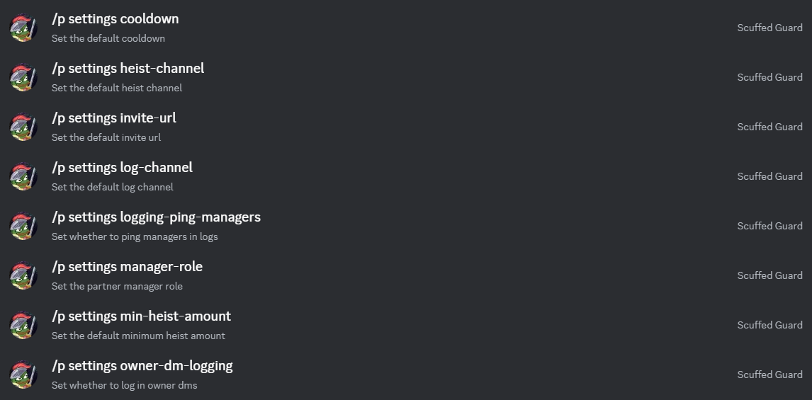

# 🐢 Setup


Running the setup command before sending any partner offers is recommended since it saves the hassle of mentioning the same fields again and again. Moreover, using default values offers flexibility which is discussed in the last section of this page. [#about-default-values](setup.md#about-default-values "mention")


### Using setup command

Setting up the bot can be done using one simple command `/p setup`


Setup command can only be used if the server has not set any settings otherwise use settings command.

[#using-settngs-command](setup.md#using-settngs-command "mention")



heist-channel is where the ads will be posted. NOT where the heist will happen.



Make sure the invite link you use does not expire or is vanity link.


### Using settings command

You can use `/p settings` command to manually set individual setting fields.

<figure><figcaption></figcaption></figure>

### About default values

Once you've set default values in the settings either using `/p setup` command or `/p settings` command you can start adding partners without explicitly mentioning the partner fields (channel, invite, cooldown, etc).

This is useful when you want to change ad-posting channel or invite url or any partner fields you dont have to change the same for each partner, but only in the settings and then all partners using the default values will start using the newly set values instead of the previous ones.
